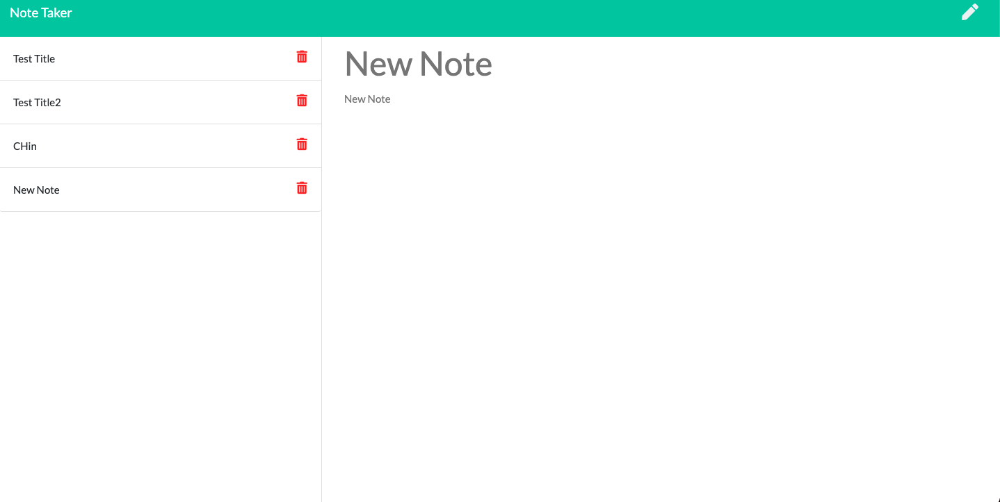

# Noter Taker App


## Table of Contents

[DESCRIPTION](#description)

[LICENSE](#license)

[INSTALLATION](#installation)

[USAGE](#usage)

[CONTRIBUTE](#contribute)

[QUESTIONS](#Questions)

## DESCRIPTION

Noter Taker that will be save your notes into an .json file and also delete them. This application also uses Express.js and node to connect and organize the backend. Lastly we use UUID npm package to identify the notes that need to be deleted.



## INSTALLATION

```bash
git clone this repo and then install npm install express and uuid (for unique ids for new ids for delete function to work)
```

## USAGE

Click the link below

You will be able just click the link and start typing your notes

[Note Taker App](https://intense-beyond-50297.herokuapp.com)

## LICENSE


This application is using the MIT license

## Contribute

If you would like to contribute please follow the [contributors convenent](https://www.contributor-covenant.org/version/2/0/code_of_conduct/code_of_conduct.txt)

## Questions

If you have questions or spot an issue please contact me through github or email below:

Github: [Chinedu613](https://github.com/Chinedu613)

Email: cchukwuani@gmail.com
